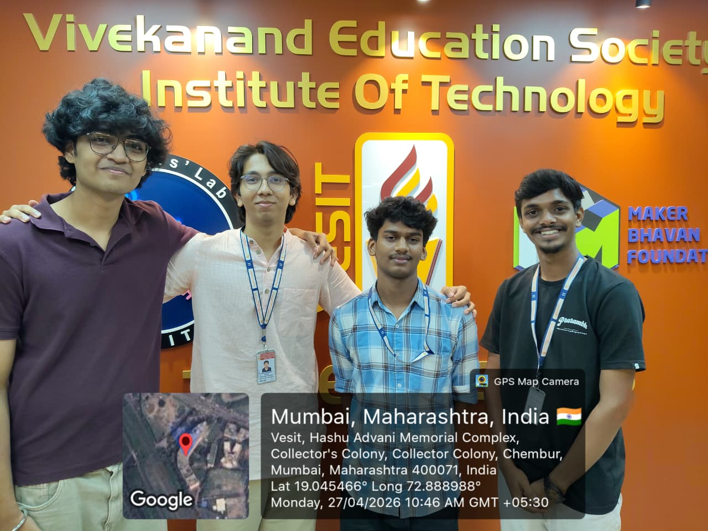
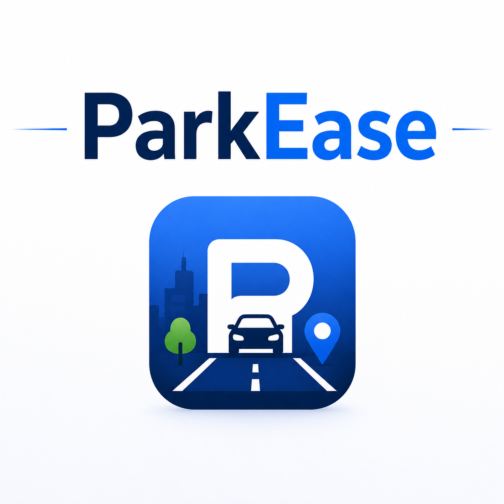

# SKILL LAB PRATICAL HACKATHON

## Final Project README

> **Project Weight:** 100%  
> **Team Size:** 4/3 students  
> **Project Duration:** 8 hours  
> **Total Time Available:** 32 effort-hours per team  
> **Project Type:** Playful, interactive, technology-based experience

---

# Before you begin

## Fork and rename this repository

After forking this repository, rename it using the format:

`SKILLLAB_PROR-2026-TeamName`

### Example

`SKILLLAB_PROR-2026-AuroWizards`

Do not keep the default repository name.

---

# How to use this README

This file is your team’s **working project document**.

You must keep updating it throughout the build period.  
By the final review, this README should clearly show:

- your idea,
- your planning,
- your design decisions,
- your technical process,
- your build progress,
- your testing,
- your failures and changes,
- your final outcome.

## Rules

- Fill every section.
- Do not delete headings.
- If something does not apply, write `Not applicable` and explain why.
- Add images, screenshots, sketches, links, and videos wherever useful.
- Update task status and weekly logs regularly.
- Use this file as evidence of process, not only as a final report.

---

# 1. Team Identity

## 1.1 Studio / Group Name

`VESDivas`

## 1.2 Team Members

| Name           | Primary Role                    | Secondary Role | Strengths Brought to the Project |
| -------------- | ------------------------------- | -------------- | -------------------------------- |
| `Narendra Bhujbal` | `[Electronics]`             | `[Coding / App]`| `Material Handeling, Software `|
| `Anuj Gujar`   | `[App]`                         | `[Electronics/Fabrication]`| `App Dev, Hardware`    |
| `Mihir Gupta`  | `[Documentation]`               | `[App]`         | `Documenting, App Dev`    |
| `Vedant Jathar`| `[Fabrication]`                 | `[Documentation]`| `Material Handling`    |

## 1.3 Project Title

`"ParkEase"`

## 1.4 One-Line Pitch

`A smart, real-time parking solution that seamlessly guides users to available spaces, making urban parking efficient, hassle-free, and accessible from the comfort of home.`

## 1.5 Expanded Project Idea

In 1–2 paragraphs, explain:

- what your project is,
- what kind of experience it creates,
- what technologies are involved.

**Response:**  
`A smart, fully customizable parking system can transform urban mobility by making parking efficient, intelligent, and stress-free from the comfort of a user’s smartphone. In this system, drivers can access real-time information about available parking spaces, navigate directly to them, and manage bookings seamlessly. Instead of wasting time searching for spots, users interact with a digital platform that integrates sensors, IoT, and automation to detect occupancy and optimize space usage. This approach makes parking more organized, reduces traffic congestion and fuel consumption, and enhances overall convenience by combining smart technology, real-time data, and user-friendly design into a practical and efficient solution. We will be using ultasonic sensors to detect the car and available parking spot which will update the app`

---

# 2. Philosophy Fit

## 2.1 Experience, Not Social Problem

Problem Statement: 
Drivers waste alot of time and fuel searching for parking, lack of real time availability and efficicent space management

We are building
an interactive object and a playful machine by using servo motor, ultrasonic, IR sensors which will help malls, societies to manage their parking system 

# 3. Inspiration

## 3.1 References

List what inspired the project.

| Source Type | Title / Link                                                        | What Inspired You                                                                         |
| ----------- | ------------------------------------------------------------------- | ----------------------------------------------------------------------------------------- |
| `[Image]`   | `https://circuitdigest.com/sites/default/files/projectimage_mic/ai-based-smart-parking-system.jpg`                  | `Turning ordinary parking lot into interactive environment by using digital visuals and sensors ` |
                                                                                          

## 3.2 Original Twist

What makes your project original?

**Response:**  

Our combination of real-time parking detection with an interactive digital experience. We are using ultrasonic, IR sensors and Servo Motor with an user friendly app, it not only shows available spaces but also helps drivers to manage parking spaces, making it more smarter and interactive than the traditional systems

---

# 4. Project Intent

## 4.1 User Journey 

Describe exactly how a user will use the project.Make it a story
**Response:**  

A driver enters a parking area such as a mall or society and is guided by smart parking system. At the entrance, mobile app shows the real-time availability of parking slots. The user can quickly check which slots are free. As the driver moves forward, ultrasonic sensor continuously monitor each parking space. Once the driver reaches the selected slot the ultrasonic sensor detects the car and confirming the slot is reserved or occupied. After parking, the system logs the vehicle’s entry and keeps track of the occupied space. 

When leaving, the driver exits the parking slot, and the sensors detect that the space is now free. The system instantly updates the availability, making the slot visible to the next user.

---

# 5. Definition of Success

## 5.1 Definition of “Usable”
A usable smart parking system is one that is simple, reliable, and efficient for everyday users. It should allow drivers to quickly check real-time parking availability, easily navigate to a free slot, and park without confusion or delay.

## 5.2 Minimum Usable Version

What is the smallest version of this project that still delivers the core experience?

**Response:**  

A minimum usable version of our smart parking system would consist of a small prototype with a limited number of parking slots, each equipped with ultrasonic sensors to detect whether a slot is occupied or free.

## 5.3 Stretch Features

What features are nice to have but not essential?

Not Applicable

---

# 6. System Overview

## 6.1 Project Type

Check all that apply.

- [x] Electronics-based

- [ ] Mechanical

- [x] Sensor-based

- [x] App-connected

- [x] Motorized

- [ ] Sound-based

- [ ] Light-based

- [x] Screen/UI-based

- [x] Fabricated structure

- [ ] Game logic based

- [ ] Installation

- [ ] Other:

## 6.2 High-Level System Description

Explain how the system works in simple terms.

Include:

Input
In this system, the input stage consists of sensors that collect data from the surrounding environment. The IR sensor detects the presence of a vehicle at the entry gate by sending a digital signal when an object is nearby. The ultrasonic sensor measures the distance of an object using sound waves and determines whether a parking slot is occupied or free. In general, input devices provide signals or data to the system for further processing . These inputs act as the initial trigger for the system’s operation.

Processing
The processing stage is handled by the Raspberry Pi Pico microcontroller, which acts as the brain of the system. It reads input signals from the sensors through GPIO pins and executes programmed logic using conditional statements. For example, it checks whether the IR sensor detects a vehicle and whether the ultrasonic sensor measures a distance less than a specific threshold. Based on these inputs, the controller performs computations and decision-making. In embedded systems, the processor receives inputs, processes them, and determines appropriate actions in real time

Output
The output stage consists of devices that respond to the processed data. The servo motor acts as a mechanical output device, opening or closing the parking gate based on the IR sensor input. The 7-segment display acts as a visual output device, showing numerical information such as slot status. Outputs are the signals or actions produced by the system after processing the input data . These outputs directly interact with the physical environment and provide feedback to the user.

Physical structure
The physical structure of the system includes the arrangement of hardware components in a functional layout. The sensors (IR and ultrasonic) are placed at the input side—IR at the gate and ultrasonic at the parking slot. The Raspberry Pi Pico is centrally positioned as the processing unit, connected to all sensors and output devices through wires and a breadboard. The servo motor is mechanically attached to the gate barrier, while the 7-segment display is positioned in a visible area to show information. An embedded system typically consists of a microcontroller, input devices, and output devices working together as a complete unit

**Response:**  

## 6.3 Input / Output Map

| System Part         | Type   | What It Does                                      |
|--------------------|--------|---------------------------------------------------|
| IR Sensor          | Input  | Detects if a car is present at the gate           |
| Ultrasonic Sensor  | Input  | Checks whether a parking slot is occupied or free |
| Servo Motor        | Output | Controls the opening and closing of the gate      |
| 7-Segment Display  | Output | Displays the number of available parking slots    |

---

# 7. Sketches and Visual Planning

## 7.1 Concept Sketch

Our early/rough sketch of project

**Insert image below:**  

  

## 7.2 Labeled Build Sketch

Add a sketch with labels showing:

- structure,
- electronics placement,
- user touch points,
- moving parts,
- output elements.

**Insert image below:**  
`[Upload image and link here]`

## 7.3 Approximate Dimensions

| Dimension        | Value   |
| ---------------- | ------- |
| Length           | `35 cm` |
| Width            | `24 cm` |

---

# 8. Electronics Planning

## 8.1 Electronics Used

| Component                 | Quantity | Purpose                               |
| ------------------------- | --------:| ------------------------------------- |
| `[Raspberry Pi Pico 2]`   | `1`      | `[Main controller]`                   |
| `[Ultrasonic sensors]`    | `3`      | `[Parking slot detection]`            |
| `[IR Sensors]`            | `1`      | `[Checks car movement]`               |
| `[7 segment display]`     | `1`      | `[Shows number of slots]`             |
| `[Servo motor]`           | `1`      | `[Controls gate movement]`            |

## 8.2 Wiring Plan

Describe the main electrical connections.

**Response:**  
The Raspberry Pi Pico 2 (RP2350) serves as the central controller of the system, managing all inputs and outputs through its GPIO pins. It is powered via a USB-C connection and operates at 3.3V logic levels. The microcontroller processes signals received from sensors and accordingly controls output devices like the display and servo motor, making it the core unit of the smart parking system.

The 7-segment display (common cathode) is connected to GPIO pins GP4 through GP10, where each pin controls one of the segments (A to G). By selectively turning these segments on or off, the Pico displays numerical information such as available parking slots. Proper current-limiting resistors are required in series with each segment to prevent damage.

The servo motor is interfaced with GPIO pin GP13, which provides a PWM signal to control its rotation angle. This motor is typically used to operate a barrier mechanism, such as opening and closing a parking gate. Since servos require higher current, they are usually powered using an external 5V supply rather than directly from the Pico.

The ultrasonic sensors (HC-SR04) are used for distance measurement and parking space detection. Ultrasonic Sensor 1 is connected with TRIG to GP17 and ECHO to GP16, Ultrasonic Sensor 2 with TRIG to GP22 and ECHO to GP20, and Ultrasonic Sensor 3 with TRIG to GP11 and ECHO to GP12. These sensors emit ultrasonic waves and measure the reflected signals to calculate distance. As the ECHO pins output 5V, voltage dividers are required to safely step down the signal to 3.3V compatible with the Pico.

The IR sensor is connected to GPIO pin GP21 and provides a digital output signal to detect the presence of an object or vehicle. It is commonly used for entry or proximity detection in the system, enabling the Pico to trigger actions like updating the display or activating the servo motor.

All components in the circuit share a common ground, which is essential for proper signal referencing and stable operation. The sensors typically operate on 5V (VBUS), while the Pico logic uses 3.3V, ensuring efficient and coordinated functioning of the entire system.
## 8.3 Circuit Diagram

Insert a hand-drawn or software-made circuit diagram.

**Insert image below:**  

# 9. Power Plan

| Question         | Response                                                                                                                                          |
| ---------------- | ------------------------------------------------------------------------------------------------------------------------------------------------- |
| Power source     | `5V 2A USB Adapter`                                                                                                                           |
| Voltage required | `4.8-6V for Servo Motor, 3.3V GPIO for 7- Segment`                                                                  |
| Current concerns | `Servo Motor draws current suddenly, Ultrasonic needs 5V Pico generates 3.3V`                                       |
| Safety concerns  | `Prevent short circuits, and secure wiring to avoid loose connections` |

---

# 10. Software Planning

## 10.1 Software Tools

| Tool / Platform                | Purpose                                        |
| ------------------------------ | ---------------------------------------------- |
| `[MicroPython]`                | `Control Pico 2`                               |
| `[HTML/CSS/Javascript]`        | `Creating app for the project`                 |

## 10.2 Software Logic

Describe what the code must do.

Include:

- startup behavior,
- input handling,
- sensor reading,
- decision logic,
- output behavior,
- communication logic,
- reset behavior.

**Response:**  
`

- **Startup behavior:**  
  The ESP32 initializes motor pins, PWM control, and starts a WiFi access point with a web server. The laptop initializes camera input, tracking system, and projection mapping.
- **Input handling:**  
  Movement commands are received from the laptop (pygame sends http requests)
- **Sensor reading:**  
  The camera continuously captures frames, and OpenCV detects ArUco markers to determine the car’s position and orientation.
- **Decision logic:**  
  The system maps the car’s position into a virtual coordinate system and checks for nearby obstacles or collisions. If movement is valid, the command is allowed; if not, it is blocked or replaced with a feedback action (like a slight shake).
- **Output behavior:**  
  The ESP32 drives the motors using PWM signals to control speed and direction. The projector displays the updated game environment, including obstacles, targets, and feedback visuals.
- **Communication logic:**  
  The laptop sends HTTP requests (e.g., `/forward`, `/left`) to the ESP32 over WiFi. The ESP32 parses these commands and executes motor actions.
- **Reset behavior:**  
  If no command is received within a short timeout, the ESP32 stops the motors. The game resets when a level is completed or restarted.`

## 10.3 Code Flowchart

Insert a flowchart showing your code logic.

Suggested sequence:

- start,
- initialize,
- wait for input,
- read input,
- decision,
- trigger output,
- repeat or reset,
- error handling.

**Insert image below:**  

# 11. Bill of Materials

## 11.1 Full BOM

| Item                             | Quantity | In Kit? | Need to Buy? | Estimated Cost | Material / Spec               | Why This Choice?          |
| -------------------------------- | --------:| ------- | ------------ | --------------:| ----------------------------- | ------------------------- |
| `[Raspberry Pi Pico 2]`          | `[1]`    | `[Yes]` | `[No]`       | `0`            | `RP2350 Microcontroller`      | `[To control components]` |
| `[Ultrasonic sensors]`           | `[3]`    | `[Yes]` | `[No]`       | `0`            | `[LN296]`                     | `[To drive both motors]`  |
| `[DC Motors and wheel]`          | `[2]`    | `[No]`  | `[Yes]`      | `[150]`        | `[BO Motors and 6 cm wheels]` | `[high torque motors]`    |
| `[Buck Converter]`               | `[1]`    | `[No]`  | `[Yes]`      | `[75]`         |                               |                           |
| `[Li-ion batteries with holder]` | `[1]`    | `[No]`  | `[Yes]`      | `[200]`        |                               |                           |

## 11.2 Material Justification

Explain why you selected your main materials and components.

**Response:**  
`DC motors (BO motors) were chosen instead of servos or steppers because the system requires continuous rotation for movement rather than precise angular control (Previously, we were considering using steppers as we were planning on tracking movement on the ESP using its relative position from an origin, but since we're using a camera now, this is not required). A motor driver (L298N) was used to allow bidirectional control and speed variation using PWM.`

## 11.3 Items You chose

| Item                 | Why Needed               | Purchase Link | Latest Safe Date to Procure | Status       |
| -------------------- | ------------------------ | ------------- | --------------------------- | ------------ |
| `BO Motors + Wheels` | `Drive system for car`   | `robu.in`     | `15th April`                | `[Received]` |
| `Buck Converter`     | `Stable power for ESP32` | `local store` | `before testing`            | `[Received]` |
| `Li-ion Batteries`   | `Portable power`         | `local store` | `before testing`            | `Recieved`   |

## 11.4 Budget Summary

| Budget Item           | Estimated Cost              |
| --------------------- | ---------------------------:|
| Electronics           | `[400]`                     |
| Mechanical parts      | `[200]`                     |
| Fabrication materials | `[0 (Available on campus)]` |
| Purchased extras      | `[0]`                       |
| Contingency           | `[300]`                     |
| **Total**             | `[900]`                     |

## 11.5 Budget Reflection

If your cost is too high, what can be simplified, removed, substituted, or shared?

**Response:**  

---

# 12. Planning the Work

## 12.1 Team Working Agreement

Write how your team will work together.

Include:

- how tasks are divided,
- how decisions are made,
- how progress will be checked,
- what happens if a task is delayed,
- how documentation will be maintained.

**Response:**  

## 12.2 Task Breakdown

| Task ID | Task                    | Owner    | Estimated Hours | Deadline     | Dependency | Status |
| ------- | ----------------------- | -------- | ---------------:| ------------ | ---------- | ------ |
| T1      | `[Finalize concept]`    | `[All]`  | `1hr`           | `27th April` | `None`     | `Done` |
| T2      | `[Connections]`         | `[Narendra]` | `2hr`       | `27th April` | `None`     | `Working` |
| T3      | `[Fabrication]`         | `[Vedant]` | `2hr`         | `27th April` | `None`     | `Done` |
| T4      | `[Documentation]`       | `[Mihir]` | `6hr`          | `27th April` | `None`     | `Working` |
| T5      | `[App Development]`     | `[Anuj]`  | `1hr`          | `27th April` | `None`     | `Working` |

## 12.3 Responsibility Split

| Area                 | Main Owner | Support Owner |
| -------------------- | ---------- | ------------- |
| Concept              | `[Anuj]`   | `[]`          |
| Electronics          | `[Narendra]`| `[Vedant]`   |
| Coding               | `[Anuj]`    | `[Mihir]`    |
| Mechanical build     | `[Vedant]`  | `[]`         |
| Testing              | `[Narendra]`| `[]`         |
| Documentation        | `[Mihir]`   | `[Anuj]`     |

---

# 13. 2 hour Milestones

## 13.1 8-hour Plan

### Bi Hour 1 — Plan and De-risk

Expected outcomes:

- [x] Idea finalized
- [x] Core interaction decided
- [x] Sketches made
- [x] BOM completed
- [x] Purchase needs identified
- [ ] Key uncertainty identified
- [x] Basic feasibility tested

### Bi Hour 2 — Build Subsystems

Expected outcomes:

- [x] Electronics tests completed
- [ ] CAD / structure planning completed
- [ ] App UI started if needed
- [x] Mechanical concept tested
- [x] Main subsystems partially working

### Bi Hour 3 — Integrate

Expected outcomes:

- [x] Physical body built
- [x] Electronics integrated
- [x] Code connected to hardware
- [ ] App connected if required
- [x] First playable version exists

### Bi Hour 4 — Refine and Finish

Expected outcomes:

- [x] Technical bugs reduced
- [x] Playtesting completed
- [x] Improvements made
- [x] Documentation completed
- [x] Final build ready

## 13.2  Update Log

| Week   | Planned Goal   | What Actually Happened | What Changed   | Next Steps     |
| ------ | -------------- | ---------------------- | -------------- | -------------- |
| Week 1 | `[Idea Finalization]` | `[Idea Finalized]`| `[NA]`       | `[Connections]`|
| Week 2 | `[Write here]` | `[Write here]`         | `[Write here]` | `[Write here]` |
| Week 3 | `[Write here]` | `[Write here]`         | `[Write here]` | `[Write here]` |
| Week 4 | `[Write here]` | `[Write here]`         | `[Write here]` | `[Write here]` |

Update 1: Basic Connection started with fabrication

 

Update 2: Connection Complete and uploaded the code on microcontroller

  

Update 3: Started with the App development

  

---

# 14. Risks and Unknowns

## 14.1 Risk Register

| Risk                                                            | Type         | Likelihood | Impact   | Mitigation Plan                                                                       | Owner                |
| --------------------------------------------------------------- | ------------ | ---------- | -------- | ------------------------------------------------------------------------------------- | -------------------- |
| WiFi connection between laptop and ESP32 becomes unstable       | `Technical`  | `Medium`   | `High`   | Keep ESP32 close, ensure stable power supply, reduce network load, add fail-safe stop | `[Gopal]`           |

## 14.2 Biggest Unknown Right Now

What is the single biggest uncertainty in your project at this stage?

**Response:**  

---

# 15. Testing 

## 15.1 Technical Testing Plan

| What Needs Testing     | How You Will Test It                                                                 | Success Condition                                                                                    |
| ---------------------- | ------------------------------------------------------------------------------------ | ---------------------------------------------------------------------------------------------------- |
| `[Wifi connection]`    | `[Check if motor spins via app button]`                                              | `[Both motors accurately respond to wifi signals]`                                                   |
                       |
## 15.2 Testing and Debugging Log

| Date          | Problem Found                         | Type         | What You Tried                                | Result               | Next Action                                    |
| ------------- | ------------------------------------- | ------------ | --------------------------------------------- | -------------------- | ---------------------------------------------- |
| `18th April`  | `Car not balancing properly`          | `Mechanical` | `Add low-friction caster support to one side` | `Worked`             | `improve caster structure`                     |

## 15.3 Playtesting Notes

| Tester      | What They Did                        | What Confused Them                    | What They Enjoyed                         | What You Will Change                          |
| ----------- | ------------------------------------ | ------------------------------------- | ----------------------------------------- | --------------------------------------------- |
| `Gopal` | `Tried navigating through obstacles` | `Some obstacles ewren't clear enough` | `Liked projection + real car interaction` | `Add a slight red highlight around obstacles` |

---

# 16. Build Documentation

## 16.1 Fabrication Process

Describe how the project was physically made.

Include:

- cutting,
- 3D printing,
- assembly,
- fastening,
- wiring,
- finishing,
- revisions.

**Response:**  
`The fabrication process involved designing, manufacturing, assembling, and refining both the physical structure and electronic integration of the system.`

`Design (CAD Modeling):
The initial model was created using CAD software, where components were designed based on the actual dimensions of the electronic parts. This ensured accurate fitting and minimized errors during assembly.
Cutting (Laser Cutting):
The designed parts were fabricated using laser cutting techniques. Sheets were cut precisely according to the CAD model to create the structural base and mounts for components.`

`Components were fixed using adhesives and mechanical supports. Certain parts were intentionally kept modular (not permanently fixed) to allow easy replacement and modification of electronics.
Surface Finishing:
Some parts were sanded to smooth rough edges after cutting. Sawdust mixed with adhesive was used to fill gaps and uneven edges, improving structural finish. The final structure was then painted for better aesthetics and durability.`

`Environment Setup (Dark Room Fabrication):
To enhance projection visibility, a controlled dark environment was created using Z-boards, paper sheets, and bedsheets. This minimized external light interference and improved projection clarity.
Revisions and Iterations:
Multiple adjustments were made throughout the process, including refining alignment, improving structural stability, repositioning components, and optimizing the interaction between the physical car and projected environment.`

## 16.2 Build Photos

Add photos throughout the project.

Suggested images:

- early sketch,
- prototype,
- electronics testing,
- mechanism test,
- app screenshot,
- final build.
- 

# 17. Final Outcome

## 17.1 Final Description

Describe the final version of your project.

**Response:**  

## 17.2 What Works Well

## 17.3 What Still Needs Improvement

## 17.4 What Changed From the Original Plan

How did the project change from the initial idea?

**Response:**  

---

# 18. Reflection

## 18.1 Team Reflection

What did your team do well?  
What slowed you down?  
How well did you manage time, tasks, and responsibilities?

**Response:**  

## 18.2 Technical Reflection

What did you learn about:

- electronics,
- coding,
- mechanisms,
- fabrication,
- integration?

**Response:**  

## 18.3 Design Reflection

What did you learn about:

- designing ,
- delight,
- clarity,
- physical interaction,
- understanding,
- iteration?

**Response:**  

## 18.4 If You Had One More hour

What would you improve next?

**Response:**  

` `

---

# 19. Final Submission Checklist

Before submission, confirm that:

- [x] Team details are complete
- [x] Project description is complete
- [x] Inspiration sources are included
- [x] Sketches are added
- [x] BOM is complete
- [x] Purchase list is complete
- [x] Budget summary is complete
- [x] Mechanical planning is documented if applicable
- [ ] App planning is documented if applicable
- [x] Code flowchart is added
- [x] Task breakdown is complete
- [x] Weekly logs are updated
- [x] Risk register is complete
- [x] Testing log is updated
- [x] Playtesting notes are included
- [x] Build photos are included
- [x] Final reflection is written

---

---

