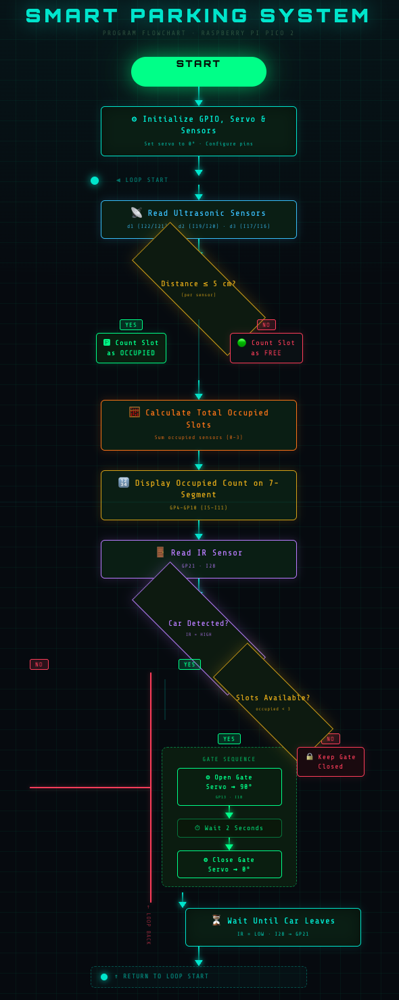

# SKILL LAB PRATICAL HACKATHON

## Final Project README

> **Project Weight:** 100%  
> **Team Size:** 4/3 students  
> **Project Duration:** 8 hours  
> **Total Time Available:** 32 effort-hours per team  
> **Project Type:** Playful, interactive, technology-based experience

---

# Before you begin

## Fork and rename this repository

After forking this repository, rename it using the format:

`SKILLLAB_PROR-2026-TeamName`

### Example

`SKILLLAB_PROR-2026-AuroWizards`

Do not keep the default repository name.

---

# How to use this README

This file is your team’s **working project document**.

You must keep updating it throughout the build period.  
By the final review, this README should clearly show:

- your idea,
- your planning,
- your design decisions,
- your technical process,
- your build progress,
- your testing,
- your failures and changes,
- your final outcome.

## Rules

- Fill every section.
- Do not delete headings.
- If something does not apply, write `Not applicable` and explain why.
- Add images, screenshots, sketches, links, and videos wherever useful.
- Update task status and weekly logs regularly.
- Use this file as evidence of process, not only as a final report.

---

# 1. Team Identity

## 1.1 Studio / Group Name

`VESDivas`

## 1.2 Team Members

| Name           | Primary Role                    | Secondary Role | Strengths Brought to the Project |
| -------------- | ------------------------------- | -------------- | -------------------------------- |
| `Narendra Bhujbal` | `[Electronics]`             | `[Coding / App]`| `Material Handeling, Software `|
| `Anuj Gujar`   | `[App]`                         | `[Electronics/Fabrication]`| `App Dev, Hardware`    |
| `Mihir Gupta`  | `[Documentation]`               | `[App]`         | `Documenting, App Dev`    |
| `Vedant Jathar`| `[Fabrication]`                 | `[Documentation]`| `Material Handling`    |

## 1.3 Project Title

`"ParkEase"`

PPT Slide
[Download Presentation](./docs/Smart-Parking-System-using-IoT.pdf_20260427_165550_0000.pdf)

YT Video
[Watch Demo Video](https://youtube.com/shorts/mWcIDCzxfRM?si=WxrZ2c0jccmO1hSr)

## 1.4 One-Line Pitch

`A smart, real-time parking solution that seamlessly guides users to available spaces, making urban parking efficient, hassle-free, and accessible from the comfort of home.`

## 1.5 Expanded Project Idea

**Response:**  
`A smart, fully customizable parking system can transform urban mobility by making parking efficient, intelligent, and stress-free from the comfort of a user’s smartphone. In this system, drivers can access real-time information about available parking spaces, navigate directly to them, and manage bookings seamlessly. Instead of wasting time searching for spots, users interact with a digital platform that integrates sensors, IoT, and automation to detect occupancy and optimize space usage. This approach makes parking more organized, reduces traffic congestion and fuel consumption, and enhances overall convenience by combining smart technology, real-time data, and user-friendly design into a practical and efficient solution. We will be using ultasonic sensors to detect the car and available parking spot which will update the app`

---

# 2. Philosophy Fit

## 2.1 Experience, Not Social Problem

Problem Statement: 
Drivers waste alot of time and fuel searching for parking, lack of real time availability and efficicent space management

We are building
an interactive object and a playful machine by using servo motor, ultrasonic, IR sensors which will help malls, societies to manage their parking system 

# 3. Inspiration

## 3.1 References

| Source Type | Title / Link                                                        | What Inspired You                                                                         |
| ----------- | ------------------------------------------------------------------- | ----------------------------------------------------------------------------------------- |
| `[Image]`   | `https://circuitdigest.com/sites/default/files/projectimage_mic/ai-based-smart-parking-system.jpg`                  | `Turning ordinary parking lot into interactive environment by using digital visuals and sensors ` |
                                                                                          

## 3.2 Original Twist

What makes your project original?

**Response:**  

Our combination of real-time parking detection with an interactive digital experience. We are using ultrasonic, IR sensors and Servo Motor with an user friendly app, it not only shows available spaces but also helps drivers to manage parking spaces, making it more smarter and interactive than the traditional systems

---

# 4. Project Intent

## 4.1 User Journey 

 

A driver enters a parking area such as a mall or society and is guided by smart parking system. At the entrance, mobile app shows the real-time availability of parking slots. The user can quickly check which slots are free. As the driver moves forward, ultrasonic sensor continuously monitor each parking space. Once the driver reaches the selected slot the ultrasonic sensor detects the car and confirming the slot is reserved or occupied. After parking, the system logs the vehicle’s entry and keeps track of the occupied space. 

When leaving, the driver exits the parking slot, and the sensors detect that the space is now free. The system instantly updates the availability, making the slot visible to the next user.

---

# 5. Definition of Success

## 5.1 Definition of “Usable”
A usable smart parking system is one that is simple, reliable, and efficient for everyday users. It should allow drivers to quickly check real-time parking availability, easily navigate to a free slot, and park without confusion or delay.

## 5.2 Minimum Usable Version

What is the smallest version of this project that still delivers the core experience?

 

A minimum usable version of our smart parking system would consist of a small prototype with a limited number of parking slots, each equipped with ultrasonic sensors to detect whether a slot is occupied or free.

## 5.3 Stretch Features

What features are nice to have but not essential?

Not Applicable

---

# 6. System Overview

## 6.1 Project Type

Check all that apply.

- [x] Electronics-based

- [ ] Mechanical

- [x] Sensor-based

- [x] App-connected

- [x] Motorized

- [ ] Sound-based

- [ ] Light-based

- [x] Screen/UI-based

- [x] Fabricated structure

- [ ] Game logic based

- [ ] Installation

- [ ] Other:

## 6.2 High-Level System Description

Input
In this system, the input stage consists of sensors that collect data from the surrounding environment. The IR sensor detects the presence of a vehicle at the entry gate by sending a digital signal when an object is nearby. The ultrasonic sensor measures the distance of an object using sound waves and determines whether a parking slot is occupied or free. In general, input devices provide signals or data to the system for further processing . These inputs act as the initial trigger for the system’s operation.

Processing
The processing stage is handled by the Raspberry Pi Pico microcontroller, which acts as the brain of the system. It reads input signals from the sensors through GPIO pins and executes programmed logic using conditional statements. For example, it checks whether the IR sensor detects a vehicle and whether the ultrasonic sensor measures a distance less than a specific threshold. Based on these inputs, the controller performs computations and decision-making. In embedded systems, the processor receives inputs, processes them, and determines appropriate actions in real time

Output
The output stage consists of devices that respond to the processed data. The servo motor acts as a mechanical output device, opening or closing the parking gate based on the IR sensor input. The 7-segment display acts as a visual output device, showing numerical information such as slot status. Outputs are the signals or actions produced by the system after processing the input data . These outputs directly interact with the physical environment and provide feedback to the user.

Physical structure
The physical structure of the system includes the arrangement of hardware components in a functional layout. The sensors (IR and ultrasonic) are placed at the input side—IR at the gate and ultrasonic at the parking slot. The Raspberry Pi Pico is centrally positioned as the processing unit, connected to all sensors and output devices through wires and a breadboard. The servo motor is mechanically attached to the gate barrier, while the 7-segment display is positioned in a visible area to show information. An embedded system typically consists of a microcontroller, input devices, and output devices working together as a complete unit

## 6.3 Input / Output Map

| System Part         | Type   | What It Does                                      |
|--------------------|--------|---------------------------------------------------|
| IR Sensor          | Input  | Detects if a car is present at the gate           |
| Ultrasonic Sensor  | Input  | Checks whether a parking slot is occupied or free |
| Servo Motor        | Output | Controls the opening and closing of the gate      |
| 7-Segment Display  | Output | Displays the number of available parking slots    |

---

# 7. Sketches and Visual Planning

## 7.1 Concept Sketch

Our early/rough sketch of project

**Insert image below:**  

  

## 7.2 Labeled Build Sketch

**Insert image below:**  
`[Upload image and link here]`

## 7.3 Approximate Dimensions

| Dimension        | Value   |
| ---------------- | ------- |
| Length           | `35 cm` |
| Width            | `24 cm` |

---

# 8. Electronics Planning

## 8.1 Electronics Used

| Component                 | Quantity | Purpose                               |
| ------------------------- | --------:| ------------------------------------- |
| `[Raspberry Pi Pico 2]`   | `1`      | `[Main controller]`                   |
| `[Ultrasonic sensors]`    | `3`      | `[Parking slot detection]`            |
| `[IR Sensors]`            | `1`      | `[Checks car movement]`               |
| `[7 segment display]`     | `1`      | `[Shows number of slots]`             |
| `[Servo motor]`           | `1`      | `[Controls gate movement]`            |

## 8.2 Wiring Plan

The Raspberry Pi Pico 2 (RP2350) serves as the central controller of the system, managing all inputs and outputs through its GPIO pins. It is powered via a USB-C connection and operates at 3.3V logic levels. The microcontroller processes signals received from sensors and accordingly controls output devices like the display and servo motor, making it the core unit of the smart parking system.

The 7-segment display (common cathode) is connected to GPIO pins GP4 through GP10, where each pin controls one of the segments (A to G). By selectively turning these segments on or off, the Pico displays numerical information such as available parking slots. Proper current-limiting resistors are required in series with each segment to prevent damage.

The servo motor is interfaced with GPIO pin GP13, which provides a PWM signal to control its rotation angle. This motor is typically used to operate a barrier mechanism, such as opening and closing a parking gate. Since servos require higher current, they are usually powered using an external 5V supply rather than directly from the Pico.

The ultrasonic sensors (HC-SR04) are used for distance measurement and parking space detection. Ultrasonic Sensor 1 is connected with TRIG to GP17 and ECHO to GP16, Ultrasonic Sensor 2 with TRIG to GP22 and ECHO to GP20, and Ultrasonic Sensor 3 with TRIG to GP11 and ECHO to GP12. These sensors emit ultrasonic waves and measure the reflected signals to calculate distance. As the ECHO pins output 5V, voltage dividers are required to safely step down the signal to 3.3V compatible with the Pico.

The IR sensor is connected to GPIO pin GP21 and provides a digital output signal to detect the presence of an object or vehicle. It is commonly used for entry or proximity detection in the system, enabling the Pico to trigger actions like updating the display or activating the servo motor.

All components in the circuit share a common ground, which is essential for proper signal referencing and stable operation. The sensors typically operate on 5V (VBUS), while the Pico logic uses 3.3V, ensuring efficient and coordinated functioning of the entire system.
## 8.3 Circuit Diagram

 

# 9. Power Plan

| Question         | Response                                                                                                                                          |
| ---------------- | ------------------------------------------------------------------------------------------------------------------------------------------------- |
| Power source     | `5V 2A USB Adapter`                                                                                                                           |
| Voltage required | `4.8-6V for Servo Motor, 3.3V GPIO for 7- Segment`                                                                  |
| Current concerns | `Servo Motor draws current suddenly, Ultrasonic needs 5V Pico generates 3.3V`                                       |
| Safety concerns  | `Prevent short circuits, and secure wiring to avoid loose connections` |

---

# 10. Software Planning

## 10.1 Software Tools

| Tool / Platform                | Purpose                                        |
| ------------------------------ | ---------------------------------------------- |
| `[MicroPython]`                | `Control Pico 2`                               |
| `[HTML/CSS/Javascript]`        | `Creating app for the project`                 |

## 10.2 Software Logic

 

- **Startup behavior:**  
  On power-up, all pins are initialized. The servo PWM is set to 50 Hz, sensors are configured (IR as input, ultrasonic TRIG/ECHO), and 7-segment pins are set as outputs. The system then enters the main loop.
- **Input handling:**  
  The system takes input from the IR sensor (digital HIGH/LOW) and the ultrasonic sensor (triggered pulse with echo response).
- **Sensor reading:**  
  Distance is measured using the ultrasonic sensor by calculating echo time. The IR sensor directly provides object detection status using ir.value().
- **Decision logic:**  
 If distance < 10 cm, the display turns ON (shows “1”). If the IR sensor detects an object, the servo opens; otherwise, it stays closed.
- **Output behavior:**  
  The 7-segment displays “1” when an object is near. The servo rotates to 90° (open) on detection and returns to 0° (closed) otherwise.
- **Communication logic:**  
No external communication is used. Only serial output via print() is used for debugging.
- **Reset behavior:**  
  On reset, the system reinitializes all components and restarts the loop, returning outputs to default before responding again.
  
## 10.3 Code Flowchart

 

# 11. Bill of Materials

## 11.1 Full BOM

| Item                             | Quantity | In Kit? | Need to Buy? | Estimated Cost | Material / Spec               | Why This Choice?          |
| -------------------------------- | --------:| ------- | ------------ | --------------:| ----------------------------- | ------------------------- |
| `[Raspberry Pi Pico 2]`          | `[1]`    | `[Yes]` | `[No]`       | `0`            | `RP2350 Microcontroller`      | `[To control components]` |
| `[Ultrasonic sensors]`           | `[3]`    | `[Yes]` | `[No]`       | `0`            | `[]`                     | `[To detect car is at the parking space or not]`  |
| `[Servo Motor]`                  | `[1]`    | `[Yes]`  | `[No]`      | `[0]`          | `[]`                          | `[Need to move the gate barrier]`    |
| `[7 segment displace]`           | `[1]`    | `[Yes]`  | `[No]`      | `[0]`         |                               |  `[To display how many slots are remaining]`                         |
| `[IR Sensors]`                   | `[1]`    | `[Yes]`  | `[No]`      | `[0]`         |                               |  `[Need to send signal to Servo Motor]`                         |

## 11.2 Material Justification

**Response:**  
`The Raspberry Pi Pico 2 is used as the main controller (brain) of the system. It reads signals from sensors, processes them, and controls output devices. It is preferred because it is small, fast, low-cost, and designed for real-time embedded systems. Unlike a full computer, it directly controls hardware through GPIO pins, making it ideal for automation projects like smart parking.`

`The IR sensor is used for *vehicle detection at the entry gate. It works by emitting infrared light and detecting reflection when an object comes near. This allows the system to know when a car arrives`

`The ultrasonic sensor is used to measure distance and detect whether a parking slot is occupied or free. It sends ultrasonic waves and calculates distance based on the echo time` 

`The 7-segment display is used for visual output, showing numbers like available slots or status. It is chosen because it is simple, low-cost, and easy to control using GPIO pins`

`The servo motor is used to control the gate movement. It can rotate to specific angles (like 0° and 90°), making it perfect for opening and closing a barrier. It is designed for **precise position control `

## 11.3 Items You chose

| Item                 | Why Needed               | 
| -------------------- | ------------------------ | 
| `IR Sensor` | `To check whether car is at the gate`   |
| `Ultrasonic Sensor`     | `check whether the car is at parking lot` |
| `Servo Motor`   | `To Move the gate`  |     

## 11.4 Budget Summary

| Budget Item           | Estimated Cost              |
| --------------------- | ---------------------------:|
| Electronics           | `[On campus]`                     |
| Mechanical parts      | `[On campus]`                     |
| Fabrication materials | `[On campus)]` |
| Purchased extras      | `[0]`                       |
| **Total**             | `[0]`                     |

## 11.5 Budget Reflection

If your cost is too high, what can be simplified, removed, substituted, or shared?

**Response:** 

NA

---

# 12. Planning the Work

## 12.1 Team Working Agreement

How tasks are divided

We divided the task by first knowing the strength of each team memeber and alloting the respective work along with their strength

How decisions are made

We collectviely discuss the new solution or feature and vote whether we can do it or not

How progress will be checked

We update the log book hourly or whenever we do a change or improve our project

What happens if a task is delayed

If the task is delayed firstly we sit together and find the issue and try to solve it, and increase the workload on that particular thing, for example if our hardware got delayed then 2 person start working on that part of the project

How documentation will be maintained.

Every time something changes,or we buy something or happens we update that on the designated section under the github repo and every couple of hours we upload the photo or our current progress

## 12.2 Task Breakdown

| Task ID | Task                    | Owner    | Estimated Hours | Deadline     | Dependency | Status |
| ------- | ----------------------- | -------- | ---------------:| ------------ | ---------- | ------ |
| T1      | `[Finalize concept]`    | `[All]`  | `1hr`           | `27th April` | `None`     | `Done` |
| T2      | `[Connections]`         | `[Narendra]` | `2hr`       | `27th April` | `None`     | `Done` |
| T3      | `[Fabrication]`         | `[Vedant]` | `2hr`         | `27th April` | `None`     | `Done` |
| T4      | `[Documentation]`       | `[Mihir]` | `6hr`          | `27th April` | `None`     | `Working` |
| T5      | `[App Development]`     | `[Anuj]`  | `1hr`          | `27th April` | `None`     | `Working` |

## 12.3 Responsibility Split

| Area                 | Main Owner | Support Owner |
| -------------------- | ---------- | ------------- |
| Concept              | `[Anuj]`   | `[]`          |
| Electronics          | `[Narendra]`| `[Vedant]`   |
| Coding               | `[Anuj]`    | `[Mihir]`    |
| Mechanical build     | `[Vedant]`  | `[]`         |
| Testing              | `[Narendra]`| `[]`         |
| Documentation        | `[Mihir]`   | `[Anuj]`     |

---

# 13. 2 hour Milestones

## 13.1 8-hour Plan

### Bi Hour 1 — Plan and De-risk

Expected outcomes:

- [x] Idea finalized
- [x] Core interaction decided
- [x] Sketches made
- [x] BOM completed
- [x] Purchase needs identified
- [x] Key uncertainty identified
- [x] Basic feasibility tested

### Bi Hour 2 — Build Subsystems

Expected outcomes:

- [x] Electronics tests completed
- [x] CAD / structure planning completed
- [x] App UI started if needed
- [x] Mechanical concept tested
- [x] Main subsystems partially working

### Bi Hour 3 — Integrate

Expected outcomes:

- [x] Physical body built
- [x] Electronics integrated
- [x] Code connected to hardware
- [ ] App connected if required
- [x] First playable version exists

### Bi Hour 4 — Refine and Finish

Expected outcomes:

- [x] Technical bugs reduced
- [x] Playtesting completed
- [x] Improvements made
- [x] Documentation completed
- [x] Final build ready

## 13.2  Update Log

| Hours   | Planned Goal   | What Actually Happened | What Changed   | Next Steps     |
| ------ | -------------- | ---------------------- | -------------- | -------------- |
| Hour 1 | `[Idea Finalization]` | `[Idea Finalized]`| `[NA]`       | `[Connections]`|
| Hour 2 | `[Hardware FInalization]` | `[Hardware Connected]`      | `[Servo Motor had to change]` | `[Software Implement]` |
| Hour 3 | `[Software Finalization]]` | `[Uploading code on microcontroller and making web app]`         | `[Had to change to code and reduce the number of ultrasonic senors]` | `[Testing and Mounting]` |
| Hour 4 | `[Testing and FInalization]` | `[Mounted the hardware on our cardboard and changed the code]`         | `[]` | `[NA]` |

Update 1: Basic Connection started with fabrication

 

Update 2: Connection Complete and uploaded the code on microcontroller

  

Update 3: Started with the App development
          Had to change our original servo motor as it got short circuited and the gate was not working

 

Update 4: We completed with our final working build

  

---

# 14. Risks and Unknowns

## 14.1 Risk Register

| Risk                                                            | Type         | Likelihood | Impact   | Mitigation Plan                                                                       | Owner                |
| --------------------------------------------------------------- | ------------ | ---------- | -------- | ------------------------------------------------------------------------------------- | -------------------- |
| Servo Motor not responding      | `Technical`  | `Medium`   | `High`   | avoid shorting of servo motor and avoid having loose connections| `[Narendra]`           |
| Ultrasonic Sensor not updating 7 Segment display| `Technical` | `Medium` | `High`   | Code updated accordingly to update the 7 segment and fix the connection of ultrasonic | `Narendra`   |

## 14.2 Biggest Unknown Right Now

What is the single biggest uncertainty in your project at this stage?

**Response:**  
The biggest uncertainty in our smart parking project is the accuracy and reliability of real-time parking space detection, as the system depends on sensors and network connectivity that can be affected by environmental conditions like rain, dust, or lighting, as well as potential hardware errors and data delays, which may lead to incorrect availability information and reduce user trust in the system.

---

# 15. Testing 

## 15.1 Technical Testing Plan

| What Needs Testing     | How You Will Test It                                                                 | Success Condition                                                                                    |
| ---------------------- | ------------------------------------------------------------------------------------ | ---------------------------------------------------------------------------------------------------- |
| `[Gate Movement]`    | `[Check if the gate moves when the car approaches the gate]`                                              | `[IR sensor detects the car and sends signal to servo motor to move the gate]` |
| `[Parking slot]`    | `[Check if the 7-segment display updates when the car reaches or leaves the parking slot]`                                              | `[Ultrasonic sensor detects the car at the spot and updates the 7-segment display]` |
                       
## 15.2 Testing and Debugging Log

| Date          | Problem Found                         | Type         | What You Tried                                | Result               | Next Action                                    |
| ------------- | ------------------------------------- | ------------ | --------------------------------------------- | -------------------- | ---------------------------------------------- |
| `27th April`  | `Gate not opening`          | `Mechanica` | `changed the servo motor` | `Worked`             | `Check ultrasonic senors`     |
| `27th April`  | `7-Segment Display Not Working`          | `Technical` | `Changed the code for ultrasonic sensor and fix the connection` | `Worked`             | `NA`     |

## 15.3 Playtesting Notes

| Tester      | What They Did                        | What Confused Them                    | What They Enjoyed                         | What You Will Change                          |
| ----------- | ------------------------------------ | ------------------------------------- | ----------------------------------------- | --------------------------------------------- |
| `Narendra` | `Checked the working of Gate and parking slot` | `The gate wasnt opening even when the car was near the sensor` | `NA` | `Change the location of IR sensor near the gate` |

---

# 16. Build Documentation

## 16.1 Fabrication Process

Cutting

We used a cardboard and cut it down as required for our project using the dimensions and scissors, and put a black chart paper on it 

Assembly

We assembled the whole circuit on the breadboard and mounted it on the carboard alongwith the neccessary sensors with the help of hot glue gun

Wiring

Connecected the microcontroller to the sensors and the servo motor with the help of jumper wires 

Finishing

Added some finishing touching to the board by marking desginated parking areas and road markings

## 16.2 Build Photos

Early sketch

Prototype

App screenshot

Final build

# 17. Final Outcome

## 17.1 Final Description

**Response:** 
Our project is a smart parking system designed to make vehicle parking more efficient, automated, and user-friendly. It integrates sensors, microcontrollers, and software to detect available parking slots in real time and guide users accordingly. The system uses IR and ultrasonic sensors to monitor slot occupancy and vehicle presence, while a servo-controlled gate automates entry and exit. A simple interface or app display provides live parking availability, reducing the time spent searching for parking and minimizing congestion.

The final build demonstrates a working prototype where vehicles are detected at the entrance, verified, and then allowed access based on slot availability. The system updates slot status dynamically and ensures smooth operation through coordinated interaction between hardware and software components. Overall, the project successfully combines electronics, coding, and mechanical design to deliver a practical solution for modern parking challenges, improving convenience, efficiency, and traffic management.

## 17.2 What Works Well
The servo-controlled gate movement and the ultrasonic parking slots works well in our project

## 17.3 What Still Needs Improvement
The servo motor could be me improve by increasing the range of detection of IR Sensor, as it is still an issue in our project

## 17.4 What Changed From the Original Plan

How did the project change from the initial idea?

**Response:**  
Addition of Servo-controlled gate was added later on in this project at first it was only based in ultrasonic sensors at parking lot

---

# 18. Reflection

## 18.1 Team Reflection

What did your team do well?  
What slowed you down?  
How well did you manage time, tasks, and responsibilities?

**Response:**  
Our team worked well in collaborating and dividing tasks effectively based on individual strengths. We maintained good communication throughout the project, which helped in integrating hardware and software smoothly. The coordination between coding, circuit design, and mechanical setup was handled efficiently, allowing us to successfully build a working prototype.

We were slowed down mainly by sensor inaccuracies and calibration issues, especially with the IR sensor, which affected detection reliability. Hardware limitations, debugging errors, and time spent troubleshooting connections and code also delayed our progress at certain stages.

We managed our time, tasks, and responsibilities by distributing work among team members and setting small goals for each phase of the project. While we followed a basic plan, some delays in testing and debugging affected our timeline. However, teamwork and consistent effort helped us complete the project and achieve the desired outcome.

## 18.2 Technical Reflection

**Response:**

Electronics:
We learned how to work with sensors like ultrasonic and IR for detection, how to interface them with a microcontroller, and how components like servo motors and motor drivers operate together. We also gained practical knowledge of circuit connections, power management, and troubleshooting hardware issues such as noise and inaccurate readings.

Coding: 
We learned how to write and structure embedded code to control sensors and actuators, especially using conditional logic and real-time decision-making. Debugging was a key learning area, along with integrating multiple components in a single program and ensuring smooth communication between hardware and software.

Mechanisms:  
We understood how mechanical movement (like the servo-controlled gate) can be synchronized with sensor input. This helped us learn about motion control, positioning, and how physical actions are triggered based on system conditions.

Fabrication:  
We gained experience in physically building the prototype, including mounting sensors, aligning components properly, and creating a stable setup. We also learned the importance of neat wiring, proper placement, and structural design for reliable performance.

Integration:  
We learned how to combine electronics, coding, and mechanical systems into one complete working model. This included handling real-time data from sensors, coordinating outputs like gate movement, and ensuring that all subsystems work together efficiently to achieve the final smart parking solution.

 

## 18.3 Design Reflection

We learned that designing is not just about how the system looks, but how efficiently it solves the problem and integrates all components. We understood that delight comes from small user-friendly features like smooth gate operation and quick response, which improve the overall experience. Clarity was important in both circuit design and code structure, as simple and well-organized systems are easier to build, debug, and maintain. Through physical interaction, we realized how hardware placement, sensor alignment, and real-world conditions directly affect performance. Understanding grew as we connected theory with practical implementation, especially while troubleshooting errors. Iteration played a key role, as we continuously tested, identified issues, and improved our design to achieve a more reliable and functional smart parking system.

  

## 18.4 If You Had One More hour

If we had more time, we would improve the accuracy and reliability of the parking detection system by enhancing sensor calibration and reducing false readings. We would also refine the gate mechanism to make it faster and smoother, ensuring better real-time response. Additionally, we would work on adding an app 

---

# 19. Final Submission Checklist

Before submission, confirm that:

- [x] Team details are complete
- [x] Project description is complete
- [x] Inspiration sources are included
- [x] Sketches are added
- [x] BOM is complete
- [x] Purchase list is complete
- [x] Budget summary is complete
- [x] Mechanical planning is documented if applicable
- [x] App planning is documented if applicable
- [x] Code flowchart is added
- [x] Task breakdown is complete
- [x] Weekly logs are updated
- [x] Risk register is complete
- [x] Testing log is updated
- [x] Playtesting notes are included
- [x] Build photos are included
- [x] Final reflection is written

---

---

